# SupplyWhiz: AI-Powered Real-Time Supply Chain Risk Platform


---

## 🚀 What is SupplyWhiz?
A modern, full-stack platform for real-time supply chain disruption monitoring, risk analysis, and automated response planning. Built for hackathons, demos, and as a foundation for enterprise supply chain AI solutions.

- **Live IoT tracking** (Traccar integration)
- **Real-time event monitoring** (news, weather, Twitter, APIs)
- **LLM-powered risk analysis & action planning**
- **Role-based access & audit logging**
- **Extensible data connectors** (Airtable, Google Sheets, CSV)
- **Interactive dashboard** (Streamlit)

---

## 🏗️ Architecture & Data Flow

```mermaid
graph TD;
  subgraph Backend
    A[FastAPI app.py] --> B[Agents: event_monitor, risk_analyzer, response_planner]
    A --> C[Routes: shipment, disruption, admin, health, integrations]
    A --> D[Auth, DB, Models, Scheduler]
    D --> E[(MySQL DB)]
    B --> E
  end
  subgraph Frontend
    F[Streamlit Dashboard]
  end
  F <--> A
  A <--> E
```



**Data Flow:**
- Real or simulated events → Risk analysis (LLM) → Action plan (LLM) → Alerts/analytics → UI
- Shipments tracked via Traccar, updated in inventory.json
- Vendor data from Airtable or CSV

---

## ⚙️ Backend: API, Agents, and Data Model

### Key Endpoints
- `/simulate_disruptions/` — Simulate or process real disruptions
- `/batch_simulate_disruptions/` — Batch risk analysis
- `/chat/` — Conversational AI (LLM Q&A)
- `/explain_risk/` — Explain risk for a shipment
- `/risk_heatmap/` — Risk analytics by location
- `/alerts/` — Get all alerts
- `/update_shipment/` — Update shipment status/location
- `/associate_traccar_device/` — Link Traccar device to shipment
- `/update_shipment_gps/` — Update shipment location from Traccar
- `/list_traccar_devices/` — List all Traccar devices
- `/admin/users/`, `/admin/audit_log/` — User management, audit
- `/check_integrations/` — API/data health check

### Data Model
- **inventory.json**: List of shipments (product_id, route, status, current_location, legs, etc.)
- **vendors.csv**/**Airtable**: Vendor info (vendor_id, name, contact, etc.)
- **alerts.json**: All generated alerts (event, risk_report, action_plan)

### How Data is Used
- **Shipments**: Always loaded from `data/inventory.json` (local file, can be extended to Google Sheets)
- **Vendors**: Loaded from Airtable if API keys are set, otherwise from `data/vendors.csv`
- **Risk Analysis**: For each disruption, affected shipments are matched by location/route; vendor info is joined; LLM analyzes and generates risk report and action plan
- **Traccar**: Used for live GPS tracking; device IDs are associated with shipments

---

## 💻 Frontend: Streamlit Dashboard & UI/UX Guidance

### Features
- **Authentication**: Login/register, role-based UI (admin/operator/viewer)
- **Disruption Simulation**: Simulate events at any location/type/severity
- **Real-Time Alerts**: View all alerts, risk reports, and action plans
- **Analytics**: Risk heatmap, alert counts, average risk score, event type breakdown
- **Shipment Management**: Update shipment status/location, associate Traccar device, update via GPS/provider
- **Maps & Timelines**: Visualize disruptions and shipment progress (Plotly, Streamlit map)
- **Admin Tools**: User management, audit log, backend health
- **Conversational AI**: Chat with the LLM about risks, shipments, and disruptions

### UI/UX Best Practices
- Use clear, role-based navigation (admin/operator/viewer)
- Show real-time feedback for all actions (success/error)
- Use maps, timelines, and analytics for visual context
- Make all API calls via the provided backend endpoints (see above)
- For new features: add new endpoints to backend, then add UI sections in Streamlit (or your preferred frontend framework)
- Use the data model: all shipment and vendor data is available via API or in `data/`

### How to Extend
- Add new event types, analytics, or visualizations by extending the backend and updating the Streamlit UI
- For a React/Next.js frontend, use the same API endpoints; see Streamlit code for example flows
- For UI/UX: focus on clarity, real-time updates, and actionable insights (risk, status, escalation)

---

## 🛠️ Setup & Integration

### 1. Clone & Install
```bash
git clone <repo-url>
cd hackathon_project_multiagent_suppply vhain analysis
pip install -r requirements.txt
```

### 2. Backend
```bash
cd backend
uvicorn app:app --reload
```
- Set up `.env` with all required API keys (see below)
- MySQL required for user management (see backend/README.md)

### 3. Frontend (Streamlit)
```bash
cd frontend
streamlit run app.py
```

### 4. Integrations
- **Traccar**: Set `TRACCAR_API`, `TRACCAR_USER`, `TRACCAR_PASS` in `.env`
- **Airtable**: Set `AIRTABLE_API_KEY`, `AIRTABLE_BASE_ID`, `AIRTABLE_TABLE_NAME` in `.env`
- **Google Sheets**: Set up service account and `GSHEET_ID` if needed
- **News/Weather/Twitter APIs**: Set keys in `.env` for real event monitoring

---

## 📦 Example API Calls

- **Simulate Disruption:**
  ```python
  requests.post("/simulate_disruptions/", json=[{"location": "Bangalore", "event_type": "Strike", ...}])
  ```
- **Update Shipment via GPS:**
  ```python
  requests.post("/update_shipment_gps/", json={"product_id": "P1001", "device_id": "1234"})
  ```
- **Get Alerts:**
  ```python
  requests.get("/alerts/")
  ```

---

## 🧑‍💻 For UI/UX & Frontend Developers
- **All data is available via API or in `data/`**
- **To add new features:**
  - Add backend endpoint (FastAPI)
  - Add UI section (Streamlit or React)
  - Use the data model: shipments, vendors, alerts
- **Best practices:**
  - Use real-time feedback (spinners, success/error)
  - Visualize risk, status, and escalation
  - Use maps, timelines, and analytics for context
  - Keep UI modular and role-based
- **See `frontend/app.py` for full example flows and API usage**

---

## 🧩 Troubleshooting & Extensibility
- **Inventory file not found?** Use absolute paths in backend
- **Traccar/Airtable not working?** Check API keys and .env
- **LLM not responding?** Check Groq/OpenAI API key
- **Add new data sources:** Extend `utils/data_loader.py` and backend agents
- **Frontend not updating?** Check API base URL and backend status

---

## 🤝 Contributing
- Fork, branch, and PR as usual
- Add tests for new features
- Keep code modular and well-documented

---

## 📄 License
MIT 

# 🧑‍💻 Frontend Developer Guide: Building a Modern React/Next.js UI for SupplyWhiz

---

## 1. API-First, Modular Architecture
- All business logic, data, and authentication are exposed via a RESTful FastAPI backend.
- Frontend (React/Next.js) is a pure API client—no business logic or data processing in the frontend.
- Role-based access (admin/operator/viewer) is enforced via JWT tokens.

## 2. How to Start: Project Structure
- Backend: All API endpoints, data models, and business logic.
- Frontend: You will build a React/Next.js app that talks to the backend via HTTP (see API below).
- Data: All shipment, vendor, and alert data is available via API (no need to read local files).

## 3. Authentication & Session Management
- Login: `POST /auth/login` with `{ email, password }` → Returns a JWT token (put in `Authorization: Bearer ...` header for all API calls).
- Register: `POST /auth/register` with `{ email, password, role }`
- Role-based UI: Use the `role` field in the JWT payload to show/hide admin/operator/viewer features.
- Session: Store JWT in localStorage or a secure cookie. Use React context or Redux for user/session state.

## 4. API Endpoints: What You Can Build
### User Flows
- Login/Register/Logout
- Change password
- Role-based dashboard (admin/operator/viewer)

### Shipment Management
- List all shipments: Use `/alerts/` to get all current alerts and risk reports (each alert includes shipment info).
- Use `/update_shipment/` to update status/location.
- Associate Traccar device: `/associate_traccar_device/` (POST)
- Update shipment via GPS: `/update_shipment_gps/` (POST)
- List Traccar devices: `/list_traccar_devices/` (GET)

### Disruption & Risk
- Simulate disruption: `/simulate_disruptions/` (POST)
- Batch simulate: `/batch_simulate_disruptions/` (POST)
- Conversational AI: `/chat/` (POST)
- Explain risk: `/explain_risk/` (GET)
- Risk heatmap: `/risk_heatmap/` (GET)

### Analytics & Visualization
- Alerts: `/alerts/`
- Risk heatmap: `/risk_heatmap/`
- Audit log (admin): `/admin/audit_log/`
- User management (admin): `/admin/users/`

## 5. How to Build: React/Next.js Patterns
### API Client
- Use `fetch`, `axios`, or `react-query`/`tanstack-query` for all API calls.
- Always include the JWT in the `Authorization` header.
- Handle 401/403 errors by redirecting to login.

### State Management
- Use React context or Redux for user/session state.
- Use SWR or React Query for data fetching, caching, and revalidation.

### Component Patterns
- AuthProvider: Handles login, logout, session, and role.
- ProtectedRoute: Redirects unauthenticated users.
- RoleBasedRoute: Shows/hides features based on user role.
- ShipmentList, ShipmentDetail, ShipmentMap, RiskHeatmap, AlertList, UserAdmin, AuditLog, ChatBot, etc.

### UI/UX Best Practices
- Show loading spinners and error messages for all API calls.
- Use modals or toasts for feedback (success/error).
- Use maps (e.g., Mapbox, Leaflet, Google Maps) for shipment/disruption visualization.
- Use charts (e.g., recharts, chart.js, plotly.js) for analytics.
- Use timelines for shipment progress.
- Use tabs or sidebars for navigation (role-based).

## 6. Data Model: What You Get from the API
- Shipment: `{ product_id, vendor_id, shipping_origin, destination, current_location, route, status, eta, criticality_score, legs, traccar_device_id }`
- Vendor: `{ vendor_id, name, ... }` (from Airtable or CSV, joined in risk analysis)
- Alert: `{ event, risk_report, action_plan }`
- Risk Report: `{ product_id, risk_score, impact_level, delay_estimate, cost_impact, escalation, summary }`
- Action Plan: `{ product_id, recommended_actions, responsible_party, priority, escalation, summary }`

## 7. How to Extend: Adding New Features
- Add a new dashboard widget? Find the API endpoint or add a new one in FastAPI. Create a new React component, fetch data, and display.
- Add a new analytics chart? Use `/alerts/` or `/risk_heatmap/` for data. Use a charting library (recharts, plotly.js, etc.).
- Add a new shipment action? Use `/update_shipment/`, `/update_shipment_gps/`, or add a new endpoint.
- Add a new notification/escalation? Use `/alerts/` to show escalated risks, or add a notification UI.

## 8. Authentication & Security
- All endpoints require JWT except `/auth/register` and `/auth/login`.
- Use HTTPS in production.
- Handle token expiry and refresh (re-login on 401).

## 9. API Documentation
- Swagger/OpenAPI UI: Visit `http://localhost:8000/docs` for interactive API docs.
- All endpoints, models, and authentication flows are documented.
- OpenAPI schema: `http://localhost:8000/openapi.json` (for codegen, e.g., [openapi-typescript-codegen](https://github.com/ferdikoomen/openapi-typescript-codegen))

## 10. Example: React API Call with JWT
```js
// Example: Fetch all alerts with JWT
const token = localStorage.getItem('jwt');
const res = await fetch('http://localhost:8000/alerts/', {
  headers: { Authorization: `Bearer ${token}` }
});
const data = await res.json();
```

## 11. Best Practices for Modern UI/UX
- Use role-based navigation and feature gating.
- Show real-time feedback for all actions.
- Use maps, timelines, and analytics for context.
- Keep UI modular, extensible, and maintainable.
- Use React Query/SWR for data fetching and caching.
- Use TypeScript for type safety (generate types from OpenAPI if desired).

## 12. How to Scaffold a Next.js App for This Backend
```bash
npx create-next-app@latest supplywhiz-frontend -ts
cd supplywhiz-frontend
npm install axios react-query jwt-decode
# (or use SWR, tanstack-query, etc.)
```
- Set up an AuthProvider for login/session.
- Create API hooks for each backend endpoint.
- Build pages/components for each feature (see above).
- Use the OpenAPI schema for type generation if desired.

## 13. Where to Find Everything
- API endpoints: See `/docs` or `README.md`
- Data model: See `data/inventory.json`, `data/vendors.csv` or Airtable, `/alerts/`
- Authentication: `/auth/login`, `/auth/register`, JWT in header
- Extending backend: Add endpoints in FastAPI, agents, or utils
- Extending frontend: Add React components/pages, use API hooks

**With this guide, your React/Next.js frontend team can confidently build a modern, real-time, role-based supply chain dashboard on top of the SupplyWhiz backend.**

If you want a starter Next.js repo, API client codegen, or more UI/UX wireframes, just ask! 

# 🚀 Unified Data Layer: Supabase for All

**All data (users, shipments, vendors, alerts, etc.) is now stored in Supabase (PostgreSQL).**
- The FastAPI backend uses the Supabase Python client for all data access.
- The Next.js frontend uses the Supabase JS client for direct CRUD/auth.
- No more MySQL, SQLite, CSV, or local files. One source of truth.

## .env Setup

**Backend:**
```
SUPABASE_URL=https://<project>.supabase.co
SUPABASE_SERVICE_KEY=your-service-role-key
```

**Frontend:**
```
NEXT_PUBLIC_SUPABASE_URL=https://<project>.supabase.co
NEXT_PUBLIC_SUPABASE_ANON_KEY=your-anon-key
```

## Example: Python (Backend)
```python
from supabase import create_client
import os
supabase = create_client(os.getenv("SUPABASE_URL"), os.getenv("SUPABASE_SERVICE_KEY"))
users = supabase.table("user").select("*").execute().data
```

## Example: Next.js (Frontend)
```js
import { createClient } from '@supabase/supabase-js'
const supabase = createClient(process.env.NEXT_PUBLIC_SUPABASE_URL, process.env.NEXT_PUBLIC_SUPABASE_ANON_KEY)
const { data, error } = await supabase.from('shipment').select('*')
```

## Developer Experience
- All teams use the same Supabase DB.
- No more DB confusion or local file issues.
- Use the Supabase dashboard for quick data edits and inspection.
- All business logic, AI, and LLM features remain in the backend.
- Frontend can use Supabase for real-time dashboards, CRUD, and auth.

**Welcome to a unified, modern, developer-friendly stack!** 